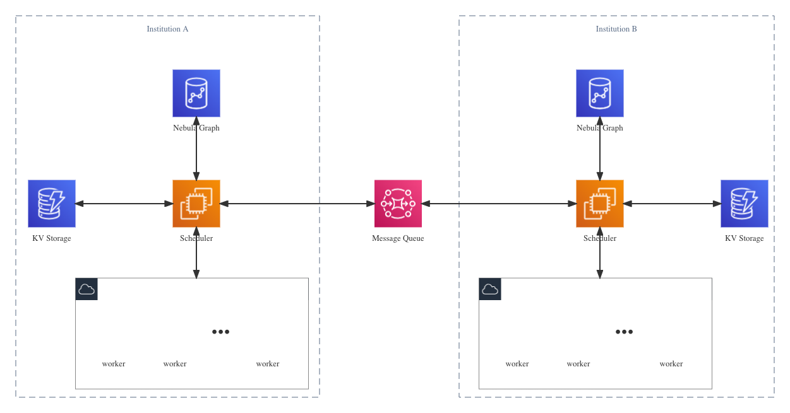

# PPGI RFC

## 项目名
Privacy Preserving Graph Intersection，隐私保护下的图求交算法

## 项目简介
在本项目中，我们将基于传统隐私集合求交算法（Private Set Intersection, PSI）实现图的隐私求交计算，从而使得在不泄露交换双方或多方额外信息的情况下，实现多方的关键ID数据对齐和交集计算。

## 项目背景
近年来以深度学习为代表的机器学习技术得到了迅速发展，越来越多的公司和组织采集了大量数据用于训练模型。但目前隐私保护法律、保护意识和技术手段都还不完善，导致用户隐私经常在采集、使用过程中被泄露。除了企业自己采集、使用数据以外，在某些场景下，比如金融风控、广告推荐等，单个企业所掌握的数据可能不足以对用户进行精确的建模，这时候就涉及到企业或机构之间交换各自数据进行联合建模，在这个过程中，也存在数据泄露的风险。

为了解决上述问题，学术界提出了联邦学习(Federated Learning)的概念，一种结合了机器学习、分布式系统、密码学的机器学习新范式，与安全多方计算、可信计算同为实现隐私计算的路径之一。作为一种分布式系统，联邦学习中的参与者既可以是不同机构，保证各个机构之间的数据不向对方泄露；也可以是某个公司与用户，保护用户的隐私数据不向公司泄露。

根据数据的组织方式不同，联邦学习又可以细分为横向联邦学习、纵向联邦学习和联邦迁移学习。在横向联邦学习中，各个机构拥有特征相同、但来自不同用户的数据集，在使用时直接将各自的数据集合并即可；在纵向联邦学习中，各个机构拥有特征不同、但部分可能来自相同用户的数据集，在使用时要根据用户ID识别出相同来源的数据，并将各自的特征拼接到一起；而在联邦迁移学习中，各个机构拥有几乎完全不同的数据集，使用时需要分别使用各自的数据集进行训练。

纵向联邦学习中需要根据用户ID将相同来源的数据合并，这个阶段被称为样本对齐，但用户ID可能是敏感数据，如果双方直接将自己拥有的全部ID发送给对方，则对方不但会知道双方ID重叠的部分，也将会知道对方额外的ID信息，这在某些情况下是不可接受的，因此研究者提出了隐私集合求交算法(Private Set Intersection)，可以保证双方知道哪些数据是双方共有的，但无法知道对方拥有的非共有数据。其他类似PSI的辅助算法还包括隐私信息检索、隐私统计分析等。

现实生活中充满了关系，比如消费者与商品、银行用户与银行用户、域名所有者与域名，以及各类知识图谱等，这些关系可以通过图的形式进行表示。随着机器学习技术的不断发展，传统的、面向结构化数据的机器学习方法如CNN等逐渐向非结构化数据扩展，从而形成了图机器学习方法。基于我们上述的讨论，可以发现当联邦学习中的数据替换成图数据时，也面临着相似的隐私问题，目前也有一些研究者在研究图与联邦学习的问题，但目前还只有很少的研究成果，因此这次我们希望结合Nebula Graph和传统的PSI算法，在这个方向进行一些探索。

## 项目价值
近年来，包括GDPR、个人信息保护法、数据安全法在内的多部法律都强调了数据安全和隐私保护的重要性，而以联邦学习为代表的隐私计算技术将提供技术上的保证。

联邦学习的常见应用场景包括金融、广告、医疗、政务，而这些场景中都积累了大量的图数据，比如金融反欺诈中各账户间的转账数据、广告中的用户点击数据、医疗知识图谱和政务中的交通、社保、税务数据。因此将联邦学习应用在图数据上势在必行。而与PSI在纵向联邦学习中的作用类似，PPGI将成为图联邦学习中的基本功能。

上面描述的是分析(OLAP)场景下的应用，另一方面，在查询(OLTP)场景下，将密码学与图数据库结合也将是一个前景广阔的方向。当前DBaaS正迅速发展，很多企业将数据放在云上，达到了降本增效的效果。但数据安全是当前一个极为敏感的话题，如何保证自己的数据不被外部攻击者以及云服务提供者窃取，是很多用户都很关心的问题，而将数据库与密码学结合，将使DBaaS的安全性得到理论的保证。

## 项目设计
### 算法介绍
#### PSI算法
传统PSI算法根据使用的密码学原语不同，有多种形式，包括基于哈希、基于RSA盲签名、基于ECDH的算法，此处将以RSA版本为例介绍PSI算法的原理，其他算法此处不再赘述。

设有A, B两个机构，各自拥有一批数据集合SA和SB，现在要计算SA和SB的交集而不向对方泄露交集以外的信息。具体流程如下：
1. A机构生成一对RSA密钥，私钥为(d, n)，公钥为(e, n)，A将公钥发送给B
2. A机构对集合SA中的每个元素si，根据如下公式进行计算：ti=H'(D(H(si)))，其中H(x)和H'(x)是密码学哈希函数，D(x)=xd mod n
3. 接下来双方进行交互，首先B机构为集合SB中的每个元素sj生成一个小于n的随机整数rj，并计算yj=H(sj)*E(rj) mod n，其中E(x)=xe mod n，然后将rj存储下来，将每一个yj发送给A机构。
4. A机构收到yj后对其进行盲签名，具体操作为计算y'j=D(yj)，并将y'j按顺序返回给B机构
5. B机构收到y'j进行去盲，即计算t'j=H'(y'j / rj)，这里利用了基础RSA算法的乘同态性质
6. 双方对集合ti和tj求交，即可得到原本数据的交集

#### PPGI算法 
PPGI算法在传统PSI算法的基础上，针对图数据的特点进行了调整，具体来说，我们将图中的结点分为敏感节点和非敏感节点，敏感节点指的是在交换过程中如果没有相交则不能向对方泄露的数据，比如用户的身份证号。非敏感数据指的是即使没有相交也会向对方发送的数据，类似于传统PSI算法中的非ID特征，比如地理位置等。

当完成传统PSI的计算后，双方会各自进行求交计算，假设双方有一个共同的哈希值ti，则双方分别进行如下计算：
- 找到ti在图中对应的结点Ai
- 获取点Ai的所有一度邻居结点Bj
  - 如果Bj是非敏感数据，则记录Bj及其与Ai之间的边，用于后续交换
  - 如果Bj是敏感数据，检查其是否在交集中。如果在交集中，则记录Bj及其与Ai的边用于交换；如果不在交集中，则不交换此节点和对应的边
- 根据用户的策略选择，上述步骤可以是单步、多步或递归进行

### 系统架构
如下图所示：

其中：
- scheduler用于调度，负责通过消息队列与对方通信，并根据使用的算法和算力要求调用合适数量的worker进行计算
- worker用于执行单步的、具体的计算
- KV存储用于储存自身需要的数据，比如RSA算法中随机数与哈希值的关系等
- 消息队列用于机构之间通信，并将计算异步化
- Nebula Graph用于储存图数据，所有数据都通过SDK从Nebula中读写

## 项目测试
测试将在如下场景中进行：
机构A, B各自拥有一批用户数据构成的图，存放在Nebula Graph数据库中，其中A机构中的数据包含了用户的身份ID、手机号和email，而B机构中的数据包含了用户的身份ID、手机号和所在地区。机构A和B达成协议要将各自的数据合并后存入一个可信第三方的Nebula Graph中用于之后的分析，其中用户的身份ID是敏感信息，其他的是非敏感信息。

运行程序后，将从机构A、B的图中得到一张新的图。

